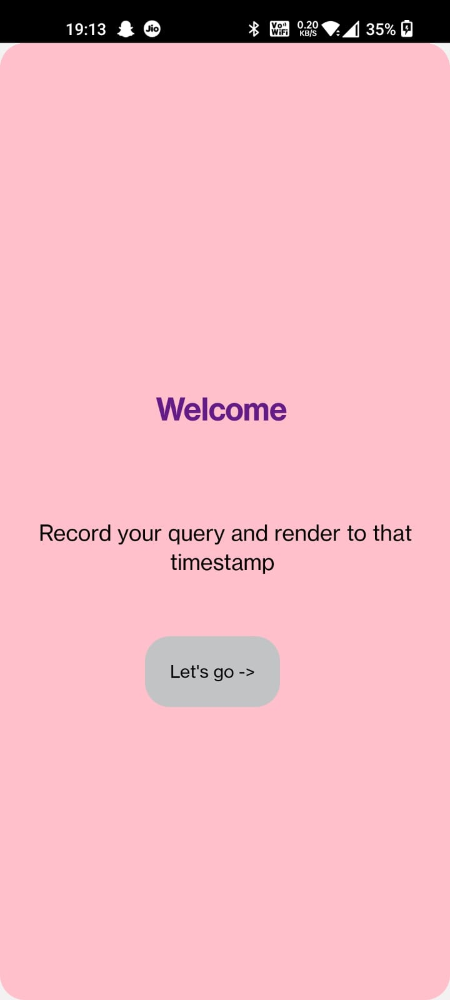
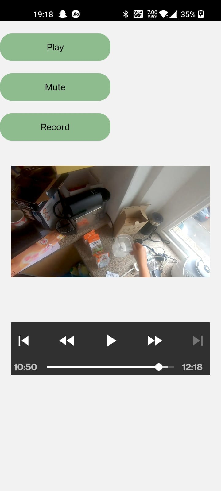
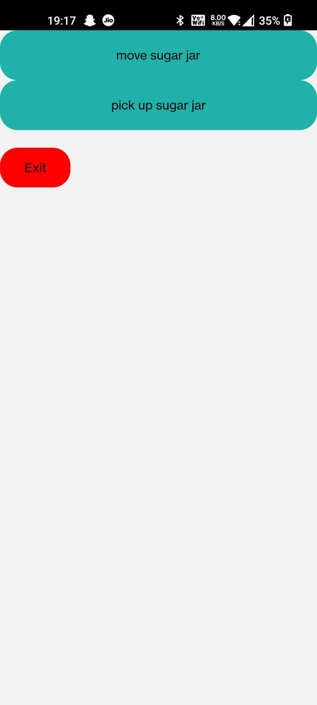
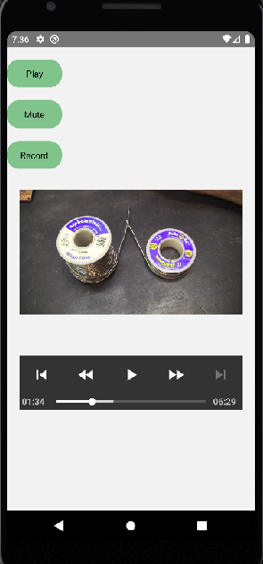
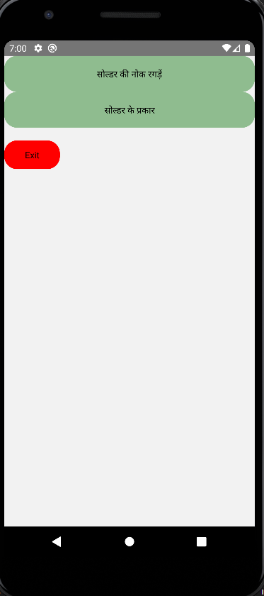

## VOICE BASED VIDEO SEEKER

If we want seek in a video, we might have to play and check multiple timestamps in a video. This project enhaces the video seeking process by mapping user "speech" input to the annotations of the video.

It consists of two react-native prototypes. It uses vosk libraries to record and convert speech as input into text. Then, it maps the user input with the annotations of the video and jumps to the specific timestamp. I have used Hindi and English standard Vosk models to convert the speech into text.

The prototypes consists of following:

- A welcome screen
- A landing screen, where we get a video player(play and stop buttons) and a "record" button to provide "speech" input.
- The app compares input and annotations and provide possible outcomes in the form of buttons. One yoy click the most appropriate option, we can seek to the specific timestamp in the video.

Following are the screenshots of Recipe App which uses English annotations:
 

Following are the screenshots of PCB App which uses Hindi annotations:
 

